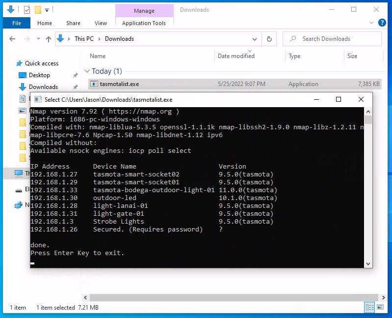

# Tasmotalist

A CLI program for searching tasmota devices within the local network. Built for Windows and Mac.



## Motivation
I have a number of tasmota devices in my  house. There are times that I need to check if they are online. Previous way of checking is going through the phone and open an app called Fing to scan my network and see the connected devices.

Once it identifies the devices, then its up to me to guess which devices are Tasmotas, which is quite cumbersome and time-consuming. This is the reason why I created this small program to search for tasmota devices on the connected network. 

## Requirements

The program is using another utility called [nmap](https://nmap.org/) to scan available devices over the connected network.

See below for the installation procedure for respective platform

* Windows:
    * [Official Installer](https://nmap.org/download.html#windows)
    * [Chocolatey](https://community.chocolatey.org/packages/nmap#install)
* Mac:
    * [Official Installer](https://nmap.org/download.html#macosx)
    * [Homebrew](https://formulae.brew.sh/formula/nmap)

## Installation

Once you have installed the mentioned requirements above, you are now ready to use Tasmotalist.

You can find the executable file in the [release page](https://github.com/jasontalon/tasmotalist/releases/tag/v1.0.0)

Or, you may build your own by downloading the [Go SDK](https://go.dev/dl/) and by cloning the repository then run the following 
```
make build
```

## Issues and Suggestions

Feel free to drop any questions, suggestions, and issues to improving the utility.

You may report by using the [Github Issues](https://github.com/jasontalon/tasmotalist/issues)


 
